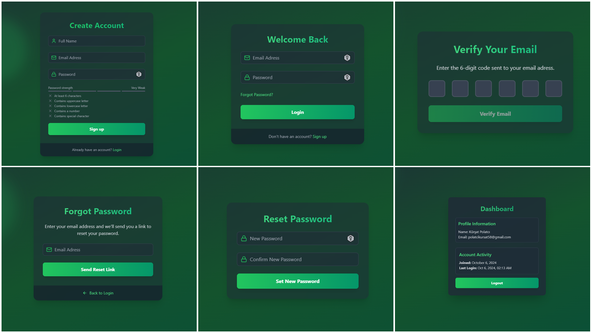

<h1 align="center">Advanced Auth 🔒 </h1>



About This Project:
-   ⚛️ Tech Stack: React.js, MongoDB, Node.js, Express, Tailwind
-   🔧 Backend Setup
-   🗄️ Database Setup
-   🔐 Signup Endpoint
-   📧 Sending Verify Account Email
-   🔍 Verify Email Endpoint
-   📄 Building a Welcome Email Template
-   🚪 Logout Endpoint
-   🔑 Login Endpoint
-   🔄 Forgot Password Endpoint
-   🔁 Reset Password Endpoint
-   ✔️ Check Auth Endpoint
-   🌐 Frontend Setup
-   📤 Implementing Signup
-   📧 Implementing Email Verification
-   🔑 Implementing Login
-   🏠 Dashboard Page
-   🔒 Protecting Our Routes
-   🔄 Implementing Forgot Password
-   🔁 Implementing Reset Password
-   🚀 Deployment

### Setup .env file

```bash
MONGO_URI=your_mongo_uri
PORT=5000
JWT_SECRET=your_secret_key
NODE_ENV=development

MAILTRAP_TOKEN=your_mailtrap_token
MAILTRAP_ENDPOINT=https://send.api.mailtrap.io/

CLIENT_URL= http://localhost:3000
```

### Run this app locally

```shell
npm run build
```

### Start the app

```shell
npm run start
```
